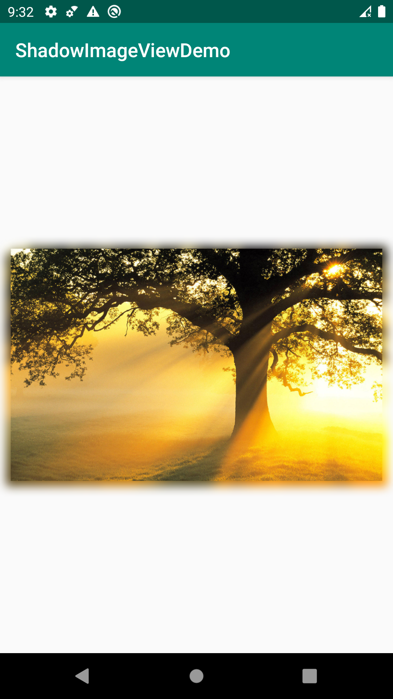

## 彩色阴影

#### 效果图：



#### 引入

```xml
    dependencies {
        implementation 'cn.xydzjnq.shadowimageview:shadowimageview:1.0.0'
    }
```

#### 使用

```xml
    <cn.xydzjnq.shadowimageview.ShadowImageView
            ...
            app:radiusOffset="7"
            app:saturation="1.0"
            app:shadowSaturation="1.3"
            app:shadowWidth="6dp" />
```
```xml
    radiusOffest阴影模糊程度（大于0小于25）
    saturation饱和度
    shadowSaturation阴影饱和度
    shadowWidth阴影宽度，也是padding。
```